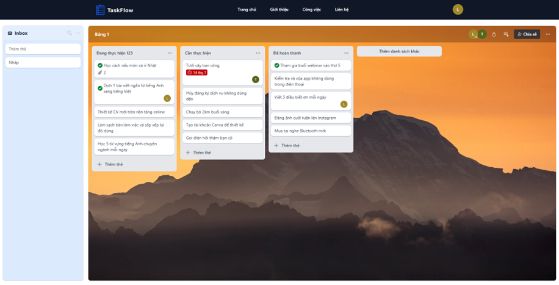

# TaskFlow - Quản lý công việc

**TaskFlow** là một ứng dụng quản lý công việc đơn giản, giúp người dùng theo dõi và quản lý các nhiệm vụ hàng ngày của mình.

## 🚀 Tính năng nổi bật

- **Đăng ký và đăng nhập**: Người dùng có thể tạo tài khoản và đăng nhập để quản lý công việc của mình.
- **Quản lý công việc**: Thêm, sửa, xóa và đánh dấu công việc đã hoàn thành.
- **Giao diện thân thiện**: Thiết kế đơn giản, dễ sử dụng với các thành phần UI hiện đại.

## 📷 Hình ảnh minh họa

## 🌐 Demo

- Vercel: https://taskflow-next.vercel.app/

## 🛠️ Công nghệ sử dụng

- **Frontend**: Next.js, Typescript, Tailwind CSS
- **Backend**: Node.js, NestJS, TypeORM, PostgreSQL
